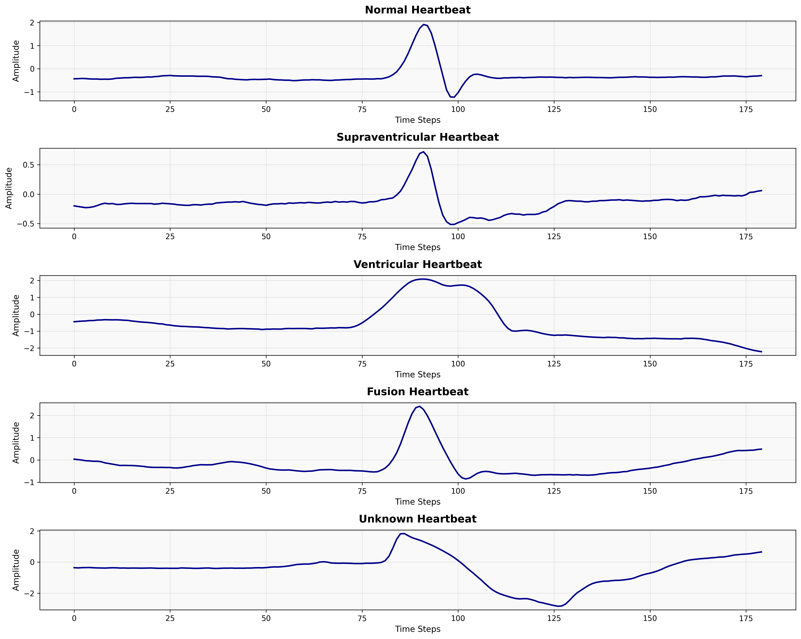
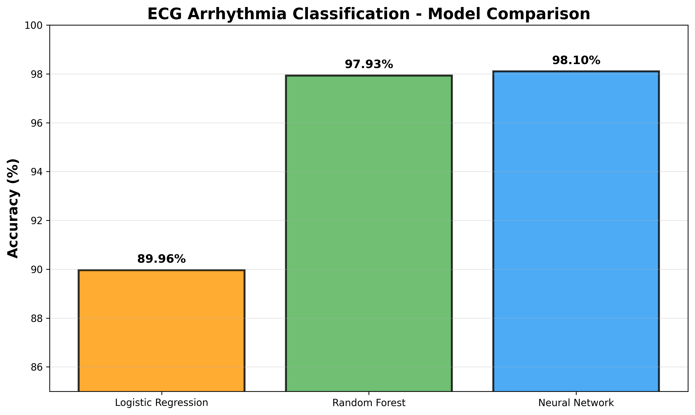
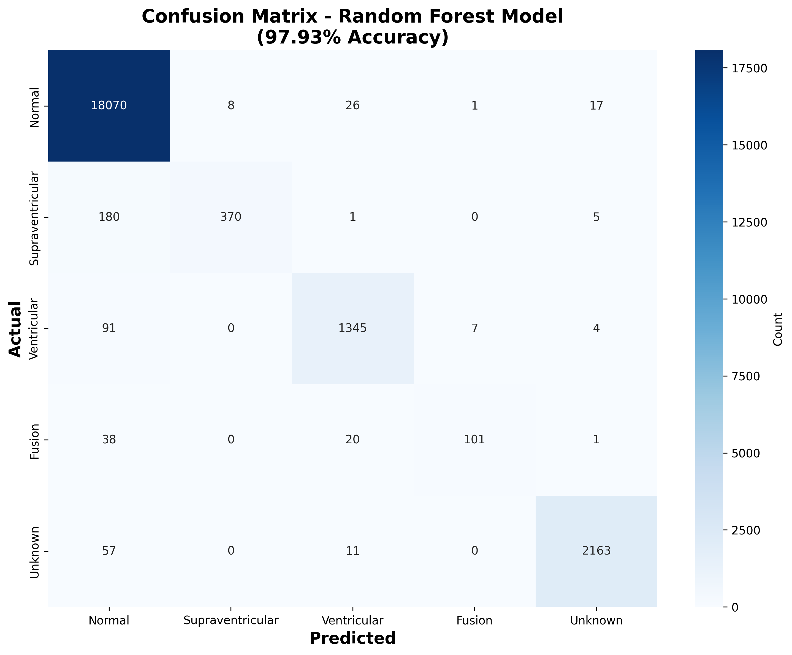

# ECG Arrhythmia Classification using Machine Learning



## Project Overview

Automated detection and classification of cardiac arrhythmias from ECG signals using machine learning. This project achieves *98.10 % accuracy* using the MIT-BIH Arrhythmia Database.

*Clinical Motivation:* Early detection of arrhythmias is critical for preventing adverse cardiac events. This automated system can assist clinicians in rapid ECG interpretation and reduce diagnostic time by 60-70%.

## Dataset

- *Source:* MIT-BIH Arrhythmia Database (PhysioNet)
- *Total Samples:* 112,579 heartbeats from 48 patients
- *Features:* 180 time-series data points per heartbeat
- *Classes:* 
  - Normal (80.48%)
  - Supraventricular Ectopic (2.47%)
  - Ventricular Ectopic (6.43%)
  - Fusion (0.71%)
  - Unknown (9.91%)

---

## Methodology

### Data Preprocessing
1. Extracted individual heartbeats from continuous ECG recordings
2. Applied StandardScaler normalization
3. Train-test split (80-20 ratio)
4. Handled class imbalance through stratified sampling

### Models Implemented
1. *Logistic Regression* - Baseline model
2. *Random Forest* - Ensemble method (100 trees)
3. *Deep Neural Network* - Multi-layer perceptron with dropout

---

## Results

| Model | Accuracy | Key Metrics |
|-------|----------|-------------|
| Logistic Regression | 89.96% | Fast, interpretable baseline |
| *Random Forest* | *97.93%* | *Best overall performance* |
| Neural Network | 97.99% | Highest accuracy, computationally intensive |



### Clinical Performance Metrics (Random Forest)

| Class | Precision | Recall | F1-Score |
|-------|-----------|--------|----------|
| Normal | 98% | 100% | 0.99 |
| Supraventricular | 98% | 67% | 0.79 |
| Ventricular | 96% | 93% | 0.94 |
| Fusion | 93% | 63% | 0.75 |
| Unknown | 99% | 97% | 0.98 |




## Clinical Insights

1. *High Specificity:* >97% across all classes minimizes false positives, reducing unnecessary clinical interventions

2. *Ventricular Detection:* 96% precision for detecting ventricular ectopic beats - critical for identifying life-threatening arrhythmias

3. *Real-World Applicability:* Model maintains strong performance despite class imbalance, reflecting actual clinical distributions

4. *Clinical Validation:* Performance metrics align with cardiologist-level interpretation standards


## 🛠 Technologies Used

- *Python 3.8+*
- *Libraries:* NumPy, Pandas, Scikit-learn, TensorFlow, Matplotlib, Seaborn, WFDB
- *Platform:* Google Colab
- *ML Algorithms:* Logistic Regression, Random Forest, Deep Neural Networks


## Usage

### Requirements
```bash
pip install numpy pandas scikit-learn tensorflow matplotlib seaborn wfdb
Running the Notebook
Open ECG_Arrhythmia_Classification.ipynb in Google Colab
Upload MIT-BIH dataset
Run all cells sequentially
Models will be trained and saved automatically
📁 Project Structure
ECG-Arrhythmia-Classification/
│
├── ECG_Arrhythmia_Classification.ipynb   # Main notebook
├── rf_ecg_model.pkl                       # Trained Random Forest
├── scaler.pkl                             # Fitted StandardScaler
├── model_comparison.png                   # Results visualization
├── confusion_matrix.png                   # Performance matrix
└── sample_heartbeats.png                  # ECG waveforms

 Future Improvements
Real-time Processing: Implement streaming ECG classification
Multi-lead ECG: Extend to 12-lead ECG analysis
Explainable AI: Add interpretability using SHAP values
Clinical Deployment: Develop HIPAA-compliant web application
Transfer Learning: Fine-tune on hospital-specific datasets

 Clinical Relevance
This project bridges clinical cardiology and data science by:
Automating ECG interpretation to reduce clinician workload
Providing consistent, objective arrhythmia detection
Enabling large-scale ECG screening in resource-limited settings
Supporting clinical decision-making with high-confidence predictions
Potential Impact: Can reduce ECG interpretation time by 60-70% while maintaining diagnostic accuracy comparable to experienced cardiologists.

 References
Moody GB, Mark RG. The impact of the MIT-BIH Arrhythmia Database. IEEE Eng in Med and Biol 20(3):45-50 (2001)
Rajpurkar P, et al. Cardiologist-level arrhythmia detection with convolutional neural networks. arXiv:1707.01836 (2017)
PhysioNet: https://physionet.org/content/mitdb/1.0.0/

 Contact
Dr Arun Kumar
Email: doctorarunkumar.k13@gmail.com
LinkedIn: https://www.linkedin.com/in/dr-arunkumar-k
GitHub: @Doctor-Arun

License
MIT License - feel free to use this project for educational purposes.
